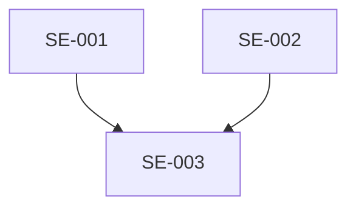

# Epic Breakdown

Take a spec's Functional Requirements and Differences sections, apply 9 decomposition patterns to produce sized sub-epics ready for sprint planning.

## Workflow

1. **Read spec** from your spec directory
2. **List** all functionality blocks and platform/user differences
3. **Evaluate** which splitting patterns apply to each block
4. **Generate sub-epics** with estimates
5. **Map dependencies** between sub-epics
6. **Suggest sprint allocation**
7. **Output** to file or print

## The 9 Splitting Patterns

| # | Pattern | When to Use |
|---|---------|-------------|
| 1 | **Workflow Steps** | Multi-step flow (create -> configure -> publish) |
| 2 | **Business Rules** | Complex validation logic |
| 3 | **Data Variations** | Multiple content types or input formats |
| 4 | **Platform Differences** | Different behavior across web/mobile/tablet/offline |
| 5 | **Operations (CRUD)** | Standard data management flow |
| 6 | **Spike/Research** | Technical unknowns or third-party integrations |
| 7 | **Performance** | Specific NFR targets |
| 8 | **Persona Variations** | Different behavior per user role |
| 9 | **Happy Path vs Edge Cases** | Feature can deliver value with just happy path |

See `references/splitting-patterns.md` for detailed examples of each pattern.

## Story Point Guide

| Points | Complexity | Example |
|--------|-----------|---------|
| 1 | Simple, no unknowns | Config change, copy update |
| 2 | Small, minor complexity | Add a field, simple UI change |
| 3 | Medium, some complexity | New API endpoint, form with validation |
| 5 | Significant, multiple components | New screen with backend integration |
| 8 | Large, cross-cutting | Offline sync, real-time updates |
| 13 | Very large — SPLIT FURTHER | Use the 9 patterns to decompose |

If estimate > 8 points, attempt to split further using the patterns.

## Output Format

```markdown
# Epic Breakdown — {Feature Name}

**Source Spec:** {path}
**Date:** {DD-MM-YYYY}
**Total Sub-Epics:** {count}
**Total Estimated Points:** {sum}

---

## Sub-Epics

### SE-001: {Title}
**Pattern:** {which of the 9}
**Estimate:** {points} points
**Spec Section:** {reference}
**Description:** {what this delivers}
**Dependencies:** {SE-NNN or "None"}
**Acceptance Summary:** {key outcomes}

---

## Dependency Map



## Sprint Allocation

| Sprint | Sub-Epics | Points | Theme |
|--------|-----------|--------|-------|
| Sprint 1 | SE-001, SE-002 | {n} | Core happy path |
| Sprint 2 | SE-003, SE-004 | {n} | Edge cases + offline |

## Summary

| Pattern Used | Count | Total Points |
|-------------|-------|-------------|
| Workflow Steps | {n} | {n} |
| Happy Path vs Edge | {n} | {n} |
```

## Anti-Patterns

- Don't create sub-epics smaller than 1 point — group them
- Don't ignore dependencies — they determine sprint order
- Don't estimate > 13 points — split further instead
- Don't skip the dependency map — it prevents sprint planning surprises

## Quality Checklist

- [ ] Every sub-epic has a clear pattern attribution
- [ ] All estimates are Fibonacci (1, 2, 3, 5, 8, 13)
- [ ] Dependencies are mapped
- [ ] Sprint allocation respects dependencies
- [ ] No sub-epic exceeds 8 points without a split rationale
