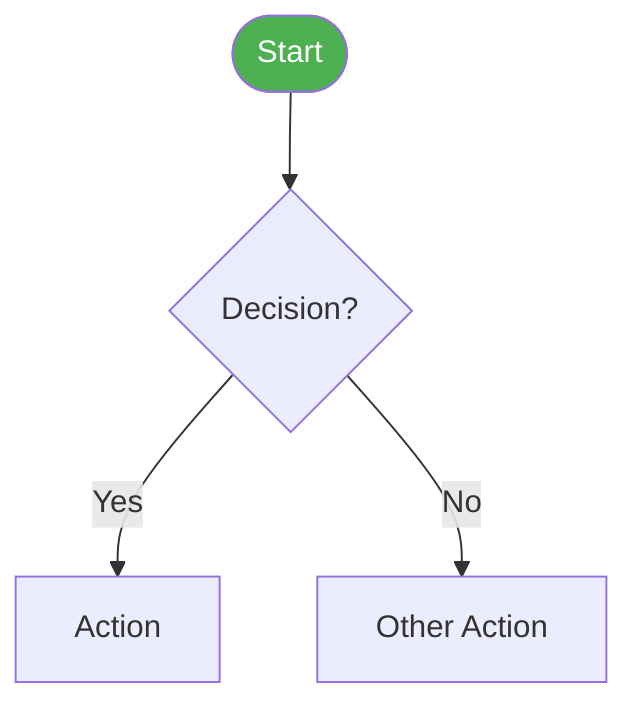

# Generate Mermaid Flowchart

Create detailed Mermaid flowchart diagrams from tickets, specs, or verbal descriptions.

## Input Types

- **Ticket key** — Fetch and create flowchart from description
- **Spec or document** — Read and create flowcharts from content
- **Verbal description** — Create flowchart directly
- **File path** — Read file and create flowcharts

## Analysis

Identify in the content:
- Decision points (if/else conditions)
- User actions (clicks, inputs)
- System actions (calculations, data changes)
- States and transitions
- Edge cases and corner cases
- Multiple scenarios (create separate diagrams if needed)

## Mermaid Formatting Rules

- **Line breaks:** ALWAYS use `<br>` in node labels, NEVER use `\n`
- **Node shapes:**
  - `([text])` for start/end (stadium shape)
  - `[text]` for actions/processes
  - `{text}` for decisions/conditions
  - `[[text]]` for subroutines
- **Color coding:**
  - `fill:#4CAF50,color:#fff` — Green for success/start
  - `fill:#EF5350,color:#fff` — Red for error/blocked
  - `fill:#FF9800,color:#fff` — Orange for modified/warning
  - `fill:#2196F3,color:#fff` — Blue for informational
- **Flow direction:** `flowchart TD` for process flows, `flowchart LR` for timelines
- **Subgraphs:** Use for grouping related items
- **Edge labels:** Use `-- text -->` for conditional paths

## Output Structure

```markdown
## {Title}

**Summary:** {description}



**Key Rules:**
- Rule 1
- Rule 2
```

## Rules

- Create SEPARATE diagrams for different scenarios
- Include a main comprehensive diagram AND simplified scenario-specific ones when multiple paths exist
- Do NOT use special characters (quotes, colons, pipes) inside node labels
- Keep node text concise (max 4 lines per node)

## Anti-Patterns

- Don't create one massive diagram when scenarios should be separate
- Don't use `\n` for line breaks — always `<br>`
- Don't skip color coding — it makes diagrams scannable

## Quality Checklist

- [ ] Node shapes match their function (decisions = diamonds, actions = rectangles)
- [ ] Color coding applied consistently
- [ ] Complex flows split into multiple diagrams
- [ ] Edge labels on conditional paths
- [ ] Key rules summarized below diagram
