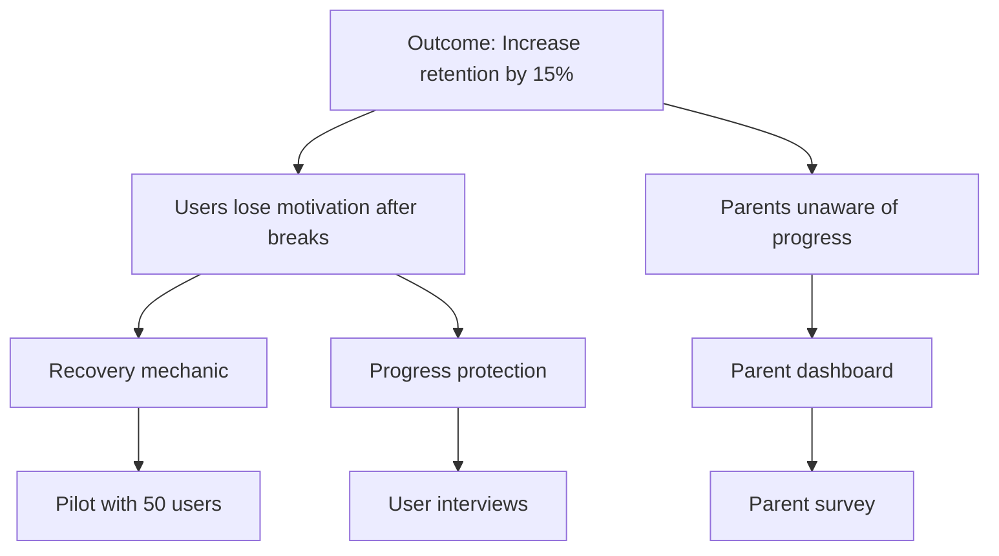

# Opportunity Solution Tree

Interactive skill that builds an OST (Teresa Torres' framework). Maps: Desired Outcome -> Opportunities -> Solutions -> Experiments.

## Workflow

1. **Define outcome** — Ask user, or read from spec success metrics / roadmap goals
2. **Read input data** — Workshop findings, pilot feedback, user research, feedback files
3. **Identify opportunities** — Unmet needs and pain points from the data
4. **Brainstorm solutions** — 2-3 solutions per opportunity
5. **Define experiments** — 1-2 validation experiments per solution
6. **Build tree** — Mermaid diagram + detailed breakdown
7. **Output** — Print to conversation or write to file

## The 4 Levels

### Level 1: Desired Outcome
The measurable business/product outcome.
- Must be specific and measurable: "Increase WAU/MAU ratio by 15%"
- Pull from spec success metrics or roadmap goals
- One tree per outcome

### Level 2: Opportunities
Unmet needs, pain points, desires — NOT solutions.
- Frame as user needs: "Users lose motivation after breaks"
- Or as "How might we..." questions
- Pull from: workshops, feedback, pilot data, persona pain points
- 3-5 opportunities per outcome

### Level 3: Solutions
Feature ideas that address specific opportunities.
- Each solution addresses ONE opportunity
- 2-3 solutions per opportunity (avoid fixating on one idea)
- Can include features already on the roadmap
- Name concretely: "Recovery Mechanic" not "engagement improvement"

### Level 4: Experiments
How to validate each solution before building.
- Types: prototype test, A/B test, user interview, pilot, data analysis, fake door test
- Each experiment has: hypothesis, method, success criteria, effort level
- 1-2 experiments per solution

## Output Format

```markdown
# Opportunity Solution Tree — {Outcome}

**Date:** {DD-MM-YYYY}
**Desired Outcome:** {specific measurable outcome}

## Tree Diagram



## Detailed Breakdown

### Opportunity 1: {description}
**Source:** {workshop/feedback/pilot}
**Evidence:** {supporting data}

#### Solution 1a: {name}
- **Description:** {brief}
- **Effort:** Low/Medium/High
- **Experiment:**
  - **Hypothesis:** If we {action}, then {expected result}
  - **Method:** {prototype/interview/pilot/data analysis}
  - **Success Criteria:** {measurable threshold}
  - **Effort:** {days/weeks}

## Priority Matrix

| Solution | Opportunity | Confidence | Effort | Priority |
|----------|------------|-----------|--------|----------|
| {name} | {which} | H/M/L | H/M/L | {1-N} |

## Recommended Next Steps
1. {highest priority experiment to run first}
2. {second priority}
3. {third priority}
```

## Anti-Patterns

- Don't jump to solutions without defining opportunities first
- Don't have only one solution per opportunity — that's not discovery, that's a feature request
- Don't skip experiments — untested solutions are guesses
- Don't define vague outcomes — "improve engagement" is not measurable

## Quality Checklist

- [ ] Outcome is specific and measurable
- [ ] Opportunities are user needs, not solutions in disguise
- [ ] Each opportunity has 2-3 solutions
- [ ] Each solution has at least 1 experiment
- [ ] Mermaid tree diagram is included
- [ ] Priority matrix ranks solutions
